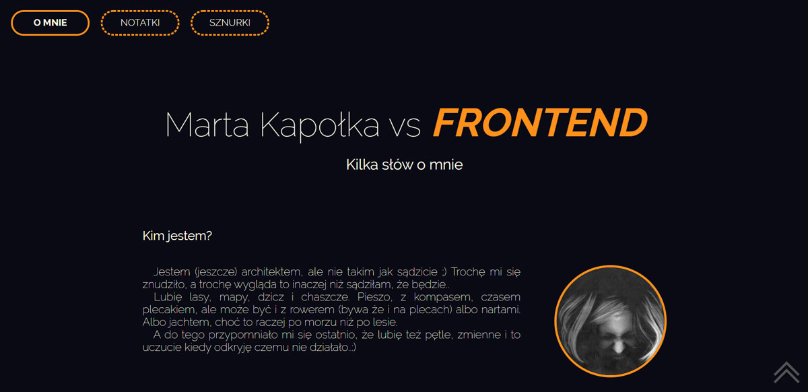

#  homepage

## &#9733; co to?

Strona domowa - poligon doświadczalny do nauki podstaw frontendu

## &#9733; po co i dlaczego?

Projekt powstał w ramach szkolenia [WTF - co ten frontend](https://cotenfrontend.pl).

Strona rozwijała się wraz z kolejnymi tygodniami szkolenia wprowadzającymi nowe wiadomości, technologie i narzędzia.

## &#9733; jak zostało zrobione?

### Technologie wykorzystane w projekcie:

- html5
- css3 (scss)
- js

## &#9733; wypróbuj!

> https://marta-kapolka.github.io/homepage/
